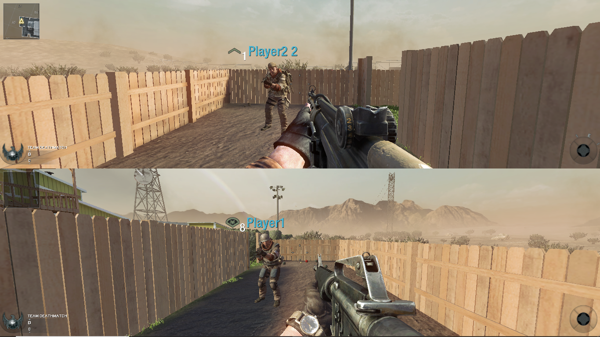
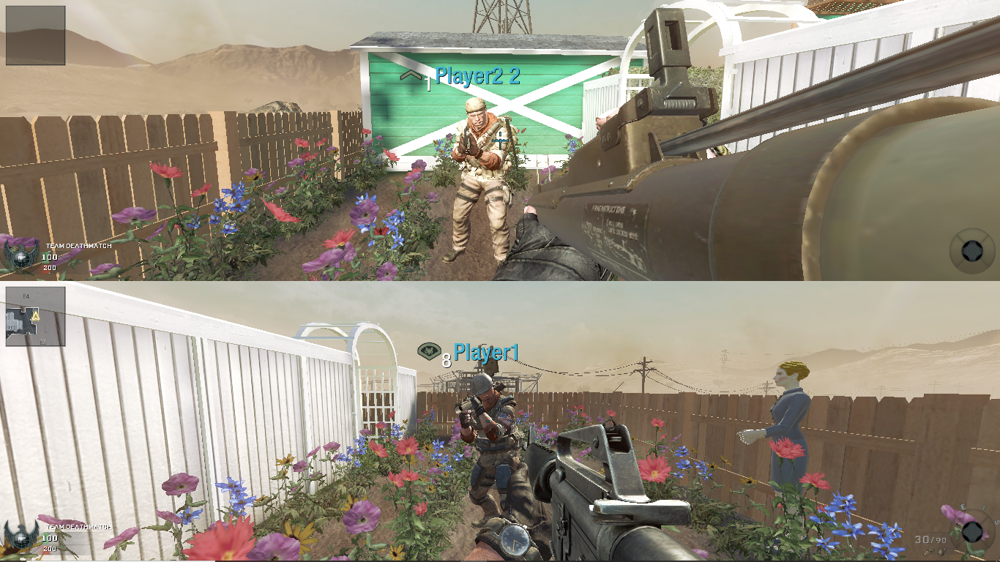
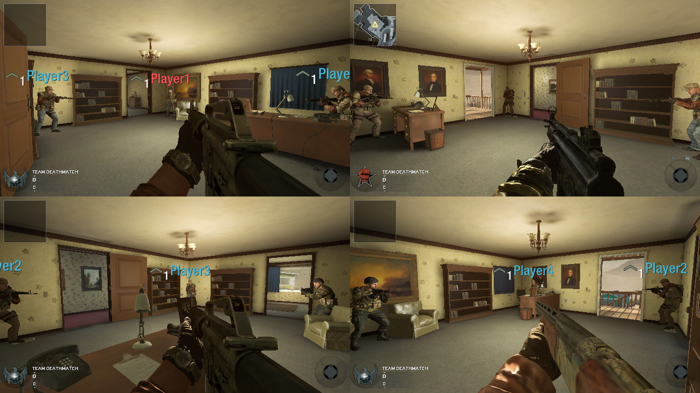
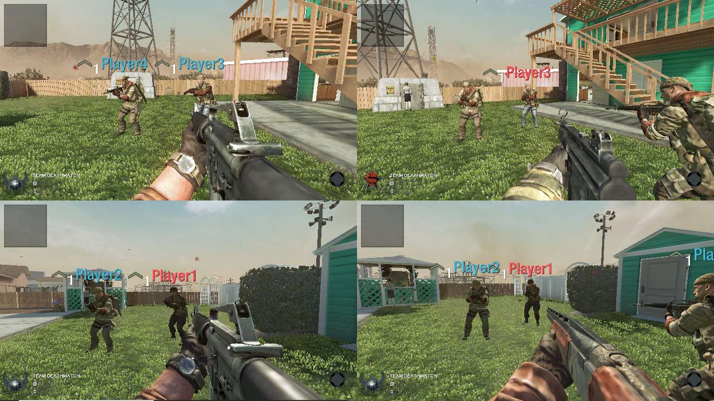

**GUIDE for Call of Duty Black ops Multiplayer & Zombies local split screen on PC with Nucleus Coop (using Bgamer version)**

**Requirements:**

● Call of Duty Black ops Legit Steam Version with all dlc 

● Latest version of the Nucleus Coop , you can get it from This [link](https://github.com/SplitScreen-Me/splitscreenme-nucleus/releases) to download the latest version and follow the installation guide.

● .NET Framework 4.7.2 or higher [link](https://dotnet.microsoft.com/en-us/download/dotnet-framework)

● Microsoft Visual C++ 2015-2019 Redistributable (both x86 and x64) [link](https://learn.microsoft.com/en-us/cpp/windows/latest-supported-vc-redist?view=msvc-170)

**Screenshot:**

>Multiplayer 

>Zombies

